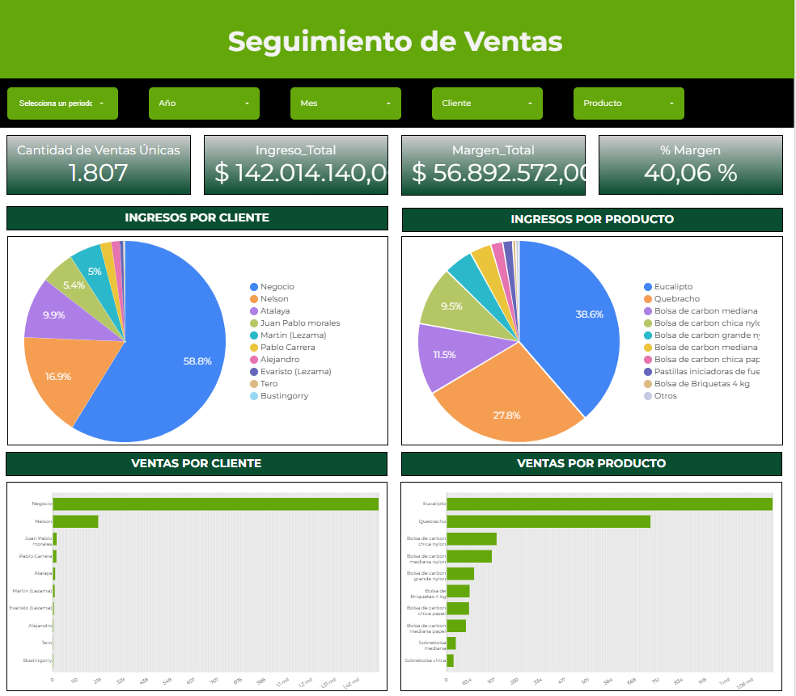

# ERP Custom: Gestión de Negocio de Combustibles Sólidos 📊🪵

## 📌 Sobre el Proyecto
Desarrollo de una solución ERP (Enterprise Resource Planning) totalmente a medida construida sobre **Google Apps Script** (AppScript) y Google Sheets. Diseñada para administrar de forma integral las operaciones de un negocio de compra/venta de carbón, leña y briquetas.

## 🚀 Arquitectura y Tecnologías
*   **Backend & Lógica de Negocio:** Google Apps Script (`.gs`). JavaScript alojado en la nube de Google.
*   **Base de Datos:** Google Sheets estructurado como base de datos relacional.
*   **Frontend (UI):** Interfaces HTML/CSS servidas por AppScript (Web App) o interfaces nativas de Google Sheets con menús personalizados.
*   **Visualización Analítica:** Conexión en vivo con [Looker Studio] para el Dashboard de Rentabilidad.

## 🛠️ Módulos Principales

### 1. Gestión Operativa
*   **Compras:** Registro de ingresos de materia prima al acopio, actualización de costos de adquisición.
*   **Producción:** Transformación de materia prima a producto final (ej. fraccionamiento de carbón a bolsas). Modificación del inventario y cálculo de mermas.
*   **Ventas:** Salida de mercadería.

### 2. Control de Inventario y Alertas
*   **Stock en Tiempo Real:** Cálculo dinámico de existencias (Ingresos + Producción - Ventas).
*   **Alertas Automatizadas:** Sistema de notificaciones por email cuando el stock de un producto cae por debajo del punto de pedido (Reorder Point).

### 3. Finanzas y Rentabilidad
*   **Caja:** Seguimiento de ingresos y egresos de caja (Cash Flow).
*   **Dashboard de Rentabilidad:** Panel interactivo que analiza el margen de ganancia cruzando el costo promedio ponderado (CPP) vs el precio de venta.
*   **Análisis Multidimensional:** Desglose de rentabilidad por Tipo de Producto y por Cliente.

## 📂 Contenido del Repositorio
*   `/src`: Archivos `.gs` (AppScript) con la lógica de negocio y automatizaciones (triggers).
*   `/html`: Vistas frontend (si aplica Web App).
*   `estructura_hojas.md`: Documentación sobre la arquitectura de la planilla.

---
## 📸 Galería
*Capturas del ERP y Dashboards funcionando*

